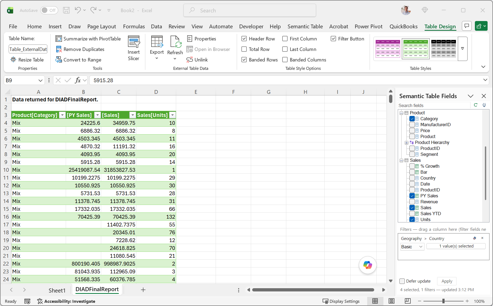

# Semantic Table

Semantic Table 0.1.0-beta.4 is a Windows Excel add-in that gives Power BI connected query tables a PivotTable-like field picker. It reads semantic-model metadata, generates DAX, updates an Excel `QueryTable`, refreshes the table, and saves the selected fields and filters in the workbook.

This is beta software. Test it with non-production workbooks and semantic models before broader deployment.

## What it does

- Opens a field pane for a Power BI semantic-model connected table.
- Discovers visible model tables, columns, measures, and hierarchies.
- Builds a bounded DAX query from selected fields and filters.
- Refreshes the existing Excel table without replacing its `ListObject`.
- Restores the previous DAX command if refresh throws an error.
- Stores table settings in hidden workbook-level names beginning with `_SemanticTable_`.

## Video tutorials

- [Introducing Semantic Table](https://youtu.be/0vctmajJzuk)
- [Getting Started](https://youtu.be/RLVnWM1Ty74)
- [Adding Connected Tables](https://youtu.be/VdI1p_iRWno)
- [Working with Fields](https://youtu.be/Vxu9d2xlw0Q)

## Screenshots



## End-user prerequisites

Install or confirm all of the following before loading Semantic Table:

1. **64-bit Windows desktop Excel.** The add-in does not support 32-bit Excel, Excel for the web, or Excel for Mac.
2. **.NET Framework 4.8 or later.** This is commonly present on supported Windows installations but remains a runtime requirement. If you have an older version you can install it from here [.NET 4.8](https://dotnet.microsoft.com/en-us/download/dotnet-framework/thank-you/net48-web-installer).
3. **The latest 64-bit Microsoft Analysis Services OLE DB Provider (MSOLAP).** Download Microsoft’s current [MSOLAP (amd64) installer](https://go.microsoft.com/fwlink/?linkid=829576) and run the MSI. Microsoft’s [Analysis Services client-libraries page](https://learn.microsoft.com/en-us/analysis-services/client-libraries) lists the current version and installation instructions. Excel might already have installed MSOLAP, but Microsoft notes that the installed copy might not be current.
4. **Power BI permissions and licensing.** The semantic model must be published to a workspace covered by Power BI Premium per User (PPU) or Fabric licensing because the add-in connects using
the model XMLA endpoint. The tenant must allow live Excel connections; the user needs semantic-model Build permission or at least Contributor access to its workspace.
5. **The Semantic Table XLL.** Download `SemanticTable-win-x64.xll` from the repository's `release` folder or the corresponding GitHub Release and add it through Excel’s Add-ins dialog.
6. **An accessible Power BI semantic model.** Use an existing Excel table connected to the model, or create a new connected table provide a valid MSOLAP connection string.

Users do **not** need to install ADOMD.NET, Analysis Services Management Objects (AMO), Microsoft Identity libraries, the Office Interop NuGet assembly, Visual Studio, or Power BI Desktop specifically for Semantic Table.

## Installation

There is no installer in the beta repository. Community releases use a single unsigned, packed x64 XLL.

1. Download `SemanticTable-win-x64.xll` from the repository's `release` folder or the corresponding GitHub Release.
2. Move it to a permanent local folder. Keep the filename unchanged so a later release can replace the file without changing Excel's add-in registration.
3. In Excel, open **File > Options > Add-ins**.
4. At the bottom, select **Excel Add-ins**, choose **Go**, and then **Browse**.
5. Select the downloaded `.xll` file.
6. If Windows or organizational policy blocks the file, use only an approved trusted location or deployment method. Do not bypass endpoint-security policy.

The add-in appears on the **Semantic Table** ribbon tab. Select a cell in a supported connected table and choose **Fields**.

## Connections and authentication

Semantic Table uses the live, authenticated MSOLAP/ADO connection associated with the Excel workbook. It does not implement a separate interactive sign-in flow and does not request or persist a separate Microsoft Entra access token.

Semantic Table calls the native MSOLAP OLE DB provider directly through .NET Framework `System.Data.OleDb`. It does not use or require ADOMD.NET or Analysis Services Management Objects (AMO).

For a new connection, the dialog starts with placeholders only:

```text
Provider=MSOLAP.8;Data Source=powerbi://api.powerbi.com/v1.0/myorg/<workspace>;Initial Catalog=<semantic-model>
```

Replace both placeholders before connecting. The complete connection string is saved in a hidden workbook-level name for that table. Do not place passwords, access tokens, or other secrets in the connection string. Workbook recipients still need their own permitted Power BI identity; normal semantic-model permissions and row-level security continue to apply.

## Power BI and Fabric licensing limitations

Semantic Table does not grant a Power BI, Microsoft Fabric, or Microsoft 365 license and cannot override tenant, workspace, semantic-model, capacity, or row-level security settings.

Microsoft documents these baseline requirements for Excel live connections:

- The tenant administrator must allow users to work with Power BI semantic models in Excel using a live connection.
- The user needs semantic-model Build permission or at least Contributor access to the workspace.
- The user needs an applicable Power BI license.
- Fabric Free users are limited to semantic models in **My workspace** or qualifying Premium/Fabric capacity; Microsoft currently documents Fabric F64 or greater for this scenario.
- PPU workspace content requires a PPU license, including XMLA and Analyze in Excel access.
- Composite models can require Build permission or Contributor rights on upstream semantic models when accessed through XMLA.

Licensing and service behavior can change. Confirm current requirements in Microsoft’s [Excel live-connection prerequisites](https://learn.microsoft.com/power-bi/collaborate-share/service-connect-power-bi-datasets-excel) and [Fabric licensing documentation](https://learn.microsoft.com/fabric/enterprise/licenses) before deployment.

## Build

### Prerequisites

- Visual Studio 2022 with .NET desktop development tools, or a compatible MSBuild/.NET SDK installation.
- .NET Framework 4.8 Developer Pack.
- Network access to restore the packages listed in `src/SemanticTable/SemanticTable.csproj`, unless they are already cached.

### Command line

```powershell
dotnet restore SemanticTable.sln
dotnet build SemanticTable.sln -c Release -p:Platform=x64 --no-restore
```

The packed 64-bit output is:

```text
src\SemanticTable\bin\x64\Release\net48\publish\SemanticTable64-packed.xll
```

For distribution, copy that packed output to the stable repository filename:

```powershell
Copy-Item src\SemanticTable\bin\x64\Release\net48\publish\SemanticTable64-packed.xll release\SemanticTable-win-x64.xll
```

The version remains embedded in the add-in and appears in the About window; it is intentionally omitted from the distributable filename so an update can replace the existing XLL in place.

You can also open `SemanticTable.sln` in Visual Studio and build `Release | x64`.

## Known limitations

- The add-in targets 64-bit Windows desktop Excel and .NET Framework 4.8.
- Existing connected tables are the best-tested path; connection layouts can differ across Microsoft 365 builds.
- Selected-field order follows semantic-model table and field order; drag-and-drop ordering is not implemented.
- Columns become grouping keys and measures are evaluated at that grouping. The output is a flat summary, not guaranteed transaction-level detail.
- Column filters support typed dates, equality, inequality, text contains, ranges, and drag-and-drop placement. Measure filters and sort expressions are not implemented.
- Calculation-group handling and explicit grain configuration are incomplete.
- Large queries remain subject to Excel, Power BI/Fabric capacity, XMLA, timeout, and model limits.
- The XLL is unsigned and is not distributed through an installer. Windows or organizational policy might block unsigned Office add-ins.
- The XLL does not bundle MSOLAP. Users must install the latest 64-bit Microsoft Analysis Services OLE DB Provider separately.

## License, warranty, and dependencies

Semantic Table source code is licensed under the [MIT License](LICENSE). The software is provided **as-is, without warranty of any kind, express or implied**.

Third-party components are not relicensed under Semantic Table’s MIT license. See [THIRD-PARTY-NOTICES.md](THIRD-PARTY-NOTICES.md). The release XLL does not redistribute MSOLAP or the Microsoft Office Interop assembly.

## Project documentation

- [Changelog](CHANGELOG.md)
- [Roadmap](ROADMAP.md)
- [Contributing](CONTRIBUTING.md)
- [Third-party notices](THIRD-PARTY-NOTICES.md)
